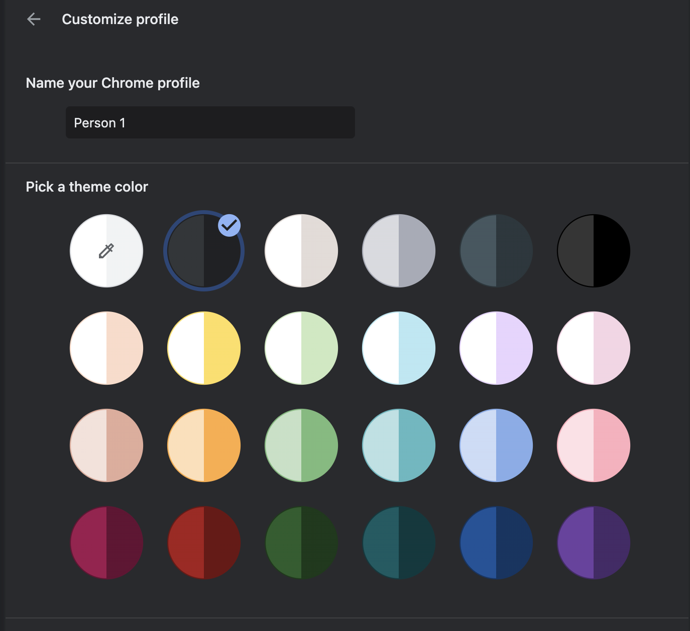
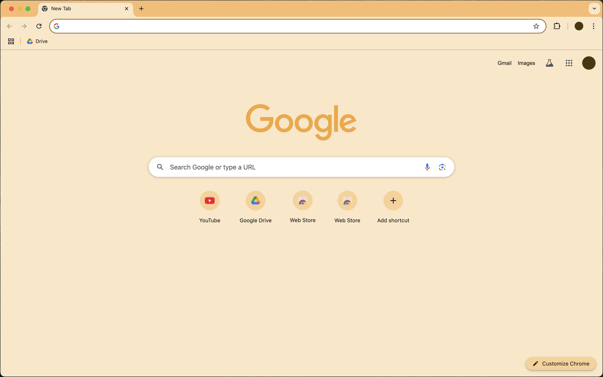

# Chrome Default Orange Recreated

Recreation of the discontinued default orange Chrome theme using color-only styling.  
Chrome’s new color picks are relatively light and lack contrast—this theme restores the classic, higher-contrast look.

## Screenshots

**Old Chrome Theme Color Options**  
*(These were available in older Chrome versions.)*

**Recreated Orange Theme in Action**  
*(Brings back the orange and higher contrast.)*

## Installation

1. **Download or Clone** this repository to your computer.
2. In Chrome, go to `chrome://extensions/`.
3. Toggle on **Developer Mode** in the top-right corner (if not already enabled).
4. Click **Load unpacked** and select this repository’s folder.
5. The theme will be installed and automatically applied.
